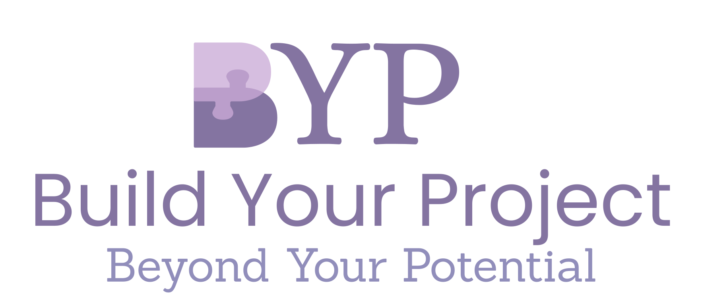

<h1 align="center">🚀 Build Your Project</h1>
<p align="center">
  Uma aplicação fullstack em <strong>Django</strong> + <strong>React</strong> para facilitar o desenvolvimento e gestão de projetos.
</p>

<p align="center">
  
</p>


<p align="center">
  <strong>🛠️ Projeto em desenvolvimento ativo - open source</strong>
</p>

---


**Conteúdo**

- [Instalar e rodar o projeto](#instalar-e-rodar-o-projeto)
  - [Dependências globais](#dependências-globais)
  - [Dependências locais](#dependências-locais)
  - [Rodar o projeto](#rodar-o-projeto)
- [Equipe](#-equipe)

## Instalar e rodar o projeto

### Dependências globais

- Python 3.10+
- Node.js 18+

### Dependências locais

Com o repositório clonado:

```bash
# Backend
cd backend
poetry install
poetry env activate 

# Frontend
cd ../frontend
npm install
```

### Rodar o projeto
```bash
cd backend
python manage.py runserver
```
Em outro terminal, rodar o frontend
```bash
cd frontend
npm run dev
```
## 👥 Equipe

<div align="center">

| [João](https://github.com/jpfelixx) | [Jossana](https://github.com/JojoMarques) | [Leticia](https://github.com/lelerudeli) |
|---|---|---|
|  |  |  |

| [Marisa](https://github.com/maris2606) | [Millena](https://github.com/Mihcup) | [Rodrigo](https://github.com/RodrigoBettio) |
|---|---|---|
|  |  |  |

</div>


